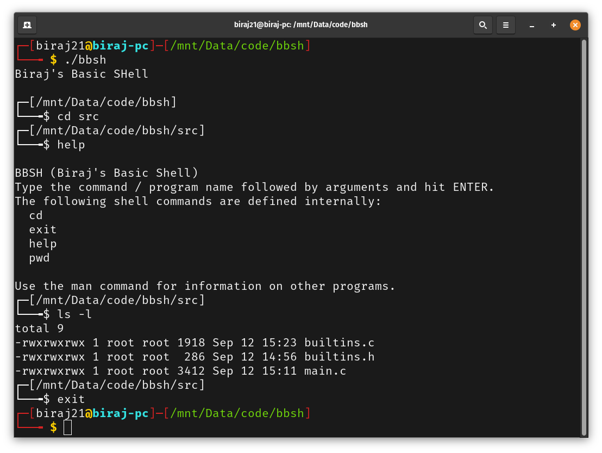

# BBSH (Biraj's Basic Shell)

BBSH is a very basic implementation of a shell in C based on [Stephen Brennan's](https://brennan.io/) article [Write a Shell in C](https://brennan.io/2015/01/16/write-a-shell-in-c/).



## Limitations
* Commands must be on a single line.
* Arguments must be separated by whitespace.
* No quoting arguments or escaping whitespace.
* No piping or redirection.
* Only builtins are: `cd`, `exit`, `pwd` and `help`.

Note: I am thinking of adding regex support. Though can't say when and how.

## Building and Running
```
make
```

```
$ ./bbsh
Biraj's Basic SHell

┌─[/mnt/Data/code/blsh]
└──╼$
```
